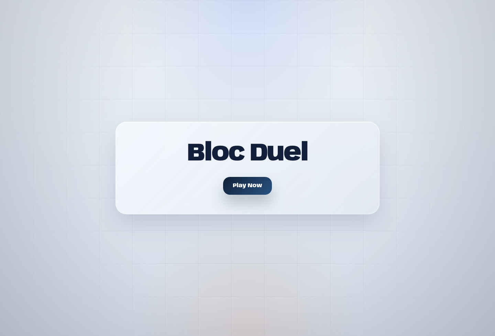
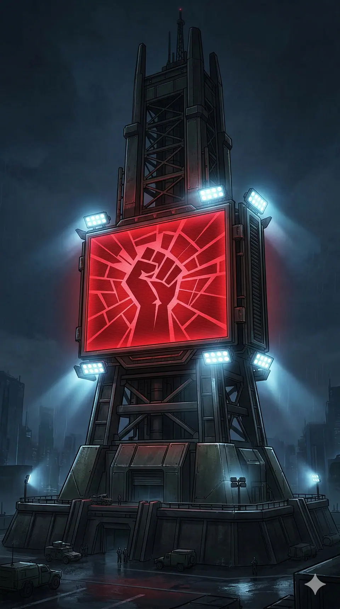

# BLOC:DUEL

Last synced: 2026-03-08

A two-player strategy card game set in a near-future geopolitical conflict. Draft cards from a shared pyramid, build your engine, invoke heroes, and race across AGI, escalation, systems, or points.

What gives the game replayability:
- shared-pyramid draft variance changes every match
- heroes create swing turns and distinct timing windows
- multiple win lines force different plans and denial patterns



### Why it feels alive

You are not just building an engine. Every draft changes what your opponent can still reach.
- race for **AGI**
- pressure the shared **escalation** track
- invest into **systems** for bonuses and the instant win
- pivot to **points** if neither side closes early

<p align="center">
  
  
  
  
</p>

The game is designed to work across:
- browser play with Cartridge Controller on Starknet Sepolia
- local burner-account play on Katana
- programmatic play through the headless SDK and agent skill

That agent-native layer also makes a plausible future direction obvious: routing autonomous play through a Daydream-style agent system, similar in spirit to Axis from Blitz.

Current public deployment:
- Frontend: [https://bloc-duel.vercel.app](https://bloc-duel.vercel.app)
- Network: Starknet Sepolia
- Wallet flow: Cartridge Controller

## Tutorial

### 1. Go to the live game

Open [https://bloc-duel.vercel.app](https://bloc-duel.vercel.app).

### 2. Connect your Cartridge Controller

Use Cartridge Controller to connect your wallet, then enter the game lobby.

### 3. Create or join a game

You can:
- create a new match and share the game id
- or join an existing lobby from the list

Once both players are in, the draft starts immediately.

### 4. Draft cards or invoke a hero

Each turn, you choose exactly one main action:
- **Play a drafted card** to get its effect
- **Sell a drafted card** for instant capital
- **Invoke a hero** instead of drafting a card

The draft is shared. Every card you take changes what your opponent can still reach.

Core card roles:
- **AI** cards advance AGI
- **MILITARY** cards move escalation
- **ECONOMY** cards build capital or production
- **SYSTEM** cards build toward bonuses and the 4-system win

Heroes are big tempo swings:
- they replace your normal draft for the turn
- they cost resources plus a hero surcharge
- they are meant to be high-impact moments, not routine buys

### Win conditions

You can win in four ways:
- **AGI Breakthrough**: reach **7 AGI**
- **Escalation Dominance**: push escalation to your side's edge
- **Systems Dominance**: collect all **4 distinct system types**
- **Points Lead**: if nobody wins early, lead on points after Age III

Points are:
- `AGI + distinct systems x2 + heroes`

The game is best when you choose a lane early, race it hard, and deny the opponent's line when you can.

## Development

Requires [Nix](https://nixos.org/) with flakes enabled. The dev environment provides all tools (Node.js, Katana, Torii, Sozo, Scarb).

The same Nix entrypoints work on Linux and macOS through native `cairo-nix` packages.

### Mode 1: Local Dev (Katana + Torii + Vite)

Full local stack — spins up a local Starknet devnet, deploys contracts, starts the indexer, and runs the frontend.

```bash
nix run .#start
```

What it does:
- Starts Katana devnet (port 5050)
- Builds & migrates Dojo contracts to Katana
- Starts Torii indexer (port 8080)
- Installs npm deps if needed
- Starts Vite dev server (port 5173)
- Uses local Katana burner accounts instead of Cartridge Controller

**When to use:** Day-to-day local development. No public-network costs, fast iteration.

### Mode 2: Public Network + Local Torii

Runs a local Torii instance indexing deployed contracts on a public Starknet network. No Katana — reads from real Starknet.

```bash
nix run .#start-mainnet
```

What it does:
- Validates `contracts/dojo_mainnet.toml` (world address, manifest)
- Starts Torii indexing mainnet (port 8080)
- Installs npm deps if needed
- Starts Vite dev server (port 5173)

**Prerequisites:** Deploy contracts first, set `world_address` and `world_block` in the relevant Dojo config.

**When to use:** Pre-production testing against real on-chain state.

### Mode 3: Public Network + Remote Torii

Frontend only — connects to a remote Torii instance. Nothing local except the dev server.

```bash
nix run .#start-mainnet-torii
```

What it does:
- Installs npm deps if needed
- Starts Vite dev server (port 5173)

**Prerequisites:** Set `PUBLIC_TORII_URL` env var pointing to your hosted Torii.

**When to use:** Production-like setup, connecting to a hosted Torii indexer.

### Mode Comparison

| | Mode 1 (Local) | Mode 2 (Public-Local) | Mode 3 (Remote Torii) |
|---|---|---|---|
| **Command** | `nix run .#start` | `nix run .#start-mainnet` | `nix run .#start-mainnet-torii` |
| **Katana** | Local devnet | -- | -- |
| **Torii** | Local | Local (indexing deployed world) | Remote |
| **Blockchain** | Local Katana | Starknet public network | Starknet public network |
| **Best for** | Development | Pre-production | Production |

### Ports

| Service | Port |
|---|---|
| Vite dev server | 5173 |
| Katana (local Starknet) | 5050 |
| Torii (indexer) | 8080 |
| Torii gRPC | 18093 |

Override with env vars: `BLOCDUEL_VITE_PORT`, `BLOCDUEL_TORII_PORT`, etc.

Disable local HTTPS when you need plain HTTP:

```bash
BLOCDUEL_DISABLE_MKCERT=1 nix run .#start
```

By default the Nix entrypoints keep `mkcert` enabled so localhost stays a trusted secure context.

### Without Nix

```bash
npm install
npm run dev
```

This only starts the frontend — you'll need to run Katana/Torii/Sozo manually.

## Sepolia Deployment

Following the same pattern as `prediction-market`, Sepolia uses its own Sozo profile and a dedicated Torii config.

### 1) Deploy the Dojo world to Sepolia

```bash
cd contracts
sozo -P sepolia build
sozo -P sepolia migrate
```

This uses `contracts/dojo_sepolia.toml` and generates `contracts/manifest_sepolia.json`.

### 2) Update the Torii config

After migration, copy the deployed world address into `contracts/torii_sepolia.toml`:

```bash
jq -r '.world.address' contracts/manifest_sepolia.json
```

Set that value as `world_address` in `contracts/torii_sepolia.toml`.

### 3) Create Torii on Cartridge Slot (`zkorp` team)

```bash
cd contracts
slot deployments create bloc-duel-sepolia torii --team zkorp --config ./torii_sepolia.toml
```

Hosted Torii URL:

```text
https://api.cartridge.gg/x/bloc-duel-sepolia/torii
```

### 4) Run the frontend against Sepolia

```bash
PUBLIC_STARKNET_NETWORK=sepolia \
PUBLIC_DOJO_MANIFEST_PROFILE=sepolia \
PUBLIC_NODE_URL=https://api.cartridge.gg/x/starknet/sepolia \
PUBLIC_TORII_URL=https://api.cartridge.gg/x/bloc-duel-sepolia/torii \
PUBLIC_WORLD_ADDRESS=$(jq -r '.world.address' contracts/manifest_sepolia.json) \
PUBLIC_ACTIONS_ADDRESS=$(jq -r '.contracts[] | select(.tag == "bloc_duel-actions") | .address' contracts/manifest_sepolia.json) \
npm run dev
```

## Headless Agent SDK

The repo also ships a headless agent client for programmatic play. It talks directly to Dojo actions and Torii, so it can:
- create and join matches
- inspect match state and legal actions
- submit moves turn by turn
- self-play locally for validation
- watch existing matches and continue them

This is not just a test harness. It is a real programmatic interface for agents to play Bloc Duel, which opens the door to agent-vs-agent ladders, automated balance runs, and future router-style integrations.

### Core API

The public entrypoint is `src/agent/index.ts`.

Main primitives:
- `createAgentClient(options)`
- `client.listMatches()`
- `client.listJoinableMatches()`
- `client.getMatch(matchId)`
- `client.createMatch()`
- `client.joinMatch(matchId)`
- `client.getLegalActions(matchId)`
- `client.submitAction(matchId, action)`
- `client.playTurn(matchId, strategy)`
- `client.playMatch(matchId, strategy, options)`
- `client.selfPlay(options)`

Strategies currently bundled:
- `random`
- `balanced`
- `race-agi`
- `race-escalation`
- `race-systems`
- `deny-agi`
- `deny-escalation`
- `deny-systems`
- `adaptive-race`

Legacy aliases still supported by the CLI/runtime:
- `greedy-agi`
- `greedy-escalation`
- `systems-first`

### Local CLI

Local commands use the deployed world in `.data/world_address.txt` automatically.

```bash
npm run agent:matches
npm run agent:open
npm run agent:create
npm run agent:join -- <matchId>
npm run agent:show -- <matchId>
npm run agent:legal -- <matchId>
npm run agent:act -- <matchId> play <position>
npm run agent:play -- <matchId> --strategy balanced
npm run agent:watch -- <matchId>
npm run agent:selfplay
```

Signer modes:
- Local Katana defaults to burner accounts automatically
- Public networks should use `--signer-mode controller-session`
- Raw `private-key` mode is kept as a fallback, not the preferred path

If you need raw access to the underlying CLI:

```bash
npm run agent:cli -- matches list --json
```

Example session-backed usage:

```bash
npm run agent:cli -- \
  --network sepolia \
  --rpc-url https://api.cartridge.gg/x/starknet/sepolia \
  --torii-url <torii-url> \
  --world-address <world-address> \
  --signer-mode controller-session \
  --session-base-path .cartridge \
  match create --json
```

### Validation

Run the systematic local SDK validation with:

```bash
npm run agent:validate
```

This covers:
- match discovery
- open-match discovery
- create/join
- show/legal/act
- watch update propagation
- match play
- join through `match act ... join`
- repeated self-play across multiple strategy pairings

The local validator is stable on Katana/Torii. Larger balance batches still depend on local chain/indexer throughput, so big self-play runs can take a few minutes.

## Mobile

The live game is meant to remain playable on mobile and compact laptops, even if the desktop battlefield is the most comfortable way to play.

Recent polish includes:
- mobile-sized draft and deployed cards
- action modal usability on touch screens
- compact-laptop access to the hero action
- reduced load-time motion so the board settles cleanly

## Balance Lab

The repo also ships a local balance harness on top of the headless SDK. It runs full match batches, collects telemetry, and scores the results against a mixed-win target meta.

Main commands:

```bash
npm run balance:run
npm run balance:report
```

What `balance:run` does:
- runs many full local games across a strategy matrix
- writes machine-readable JSON to `.data/balance/latest.json`
- prints a readable scorecard and representative sample list
- exits non-zero if any match stalls or fails

Useful options:

```bash
npm run balance:run -- --games 28 --seed lab-a
npm run balance:run -- --strategies race-agi,race-escalation,race-systems,adaptive-race
npm run balance:report -- --input .data/balance/latest.json
```

Environment overrides:
- `BLOCDUEL_BALANCE_GAMES`
- `BLOCDUEL_BALANCE_SEED`
- `BLOCDUEL_BALANCE_STRATEGIES`
- `BLOCDUEL_BALANCE_MAX_ACTIONS`
- `BLOCDUEL_BALANCE_MAX_IDLE_POLLS`
- `BLOCDUEL_BALANCE_POLL_INTERVAL_MS`
- `BLOCDUEL_BALANCE_OUTPUT`

The balance lab focuses on:
- win-condition distribution
- ending age distribution
- average turns
- first-player advantage
- discard and chain usage
- hero usage and hero win contribution
- abrupt ending rate
- matchup win rates

Bundled balance strategies:
- `race-agi`
- `race-escalation`
- `race-systems`
- `deny-agi`
- `deny-escalation`
- `deny-systems`
- `adaptive-race`

`balanced` still exists as a legacy smoke bot, but it is not the main balance signal.

## How It Works

Two rival blocs — **Atlantic** and **Continental** — compete across three ages. Each age deals 10 cards into a pyramid. Players take turns drafting: **play** a card for its effect, or **sell** it for capital.

### Win Conditions

| Victory | How |
|---|---|
| **AGI Breakthrough** | Push your AGI track to 7 |
| **Escalation Dominance** | Push the shared escalation track to your side's limit (`-6` for Atlantic, `+6` for Continental) |
| **Systems Dominance** | Collect all 4 system types |
| **Points** | If no one wins by Age 3, highest score (AGI + distinct systems x2 + heroes) wins |

### Card Types

- **AI** (blue) — Advance the AGI track
- **MILITARY** (red) — Push the escalation track
- **ECONOMY** (amber) — Generate resources or capital
- **SYSTEM** (green) — Collect system symbols for bonuses and the instant win

### Systems & Bonuses

Each system type has a 3-card chain across the ages. System cards cost resources but give no immediate effect — they're an investment.

- **Pair bonus**: Collect 2 of the same system type to unlock a permanent bonus
- **3 different**: Collect 3 different types to choose one bonus
- **All 4**: Instant victory

### Resources

| Icon | Resource | Role |
|---|---|---|
| ⚡ | Energy | Powers military and AI cards |
| ⛏️ | Materials | Builds infrastructure and systems |
| 🖥️ | Compute | Fuels AI research |
| 💰 | Capital | Universal currency — production converts to capital each turn |

### Chains

Cards can chain across ages. If you played the prerequisite card, the next link in the chain is **free**. Chains reward long-term planning over opportunistic drafting.

### Heroes

Powerful one-time recruits available each age. Each hero costs resources plus a surcharge (+3 per hero you already own). Heroes provide large effects but replace your card draft for the turn.

## If We Had More Time

The main design area we would revisit is systems. Right now doctrines work, but they are not yet as fun or as impactful as they should be.

What we would likely try next:
- unlock doctrines at either 2 different systems or 2 copies of the same system
- make doctrines feel like real game-defining moments, not minor stat bumps
- push doctrine effects toward sharper identity and interaction
- make escalation ownership legible at a glance when only one side has moved the track

Doctrine ideas worth testing:
- **Diplomacy**: reset escalation to `0` for both sides
- **Finance**: discarding cards gives `2x` capital
- **Compute**: AGI cards cost `1` less
- **Finance / hero economy**: remove excess payment friction when buying heroes

UX clarity bug worth fixing:
- when only one player has advanced escalation, the board should explicitly show which bloc currently owns that pressure instead of relying on the shared `1/6` counter alone

## Stack

React 19, TypeScript, Tailwind CSS v4, Zustand, Framer Motion, Dojo, Torii, and Cartridge Controller.

## Status

Live on Starknet Sepolia. Active development is now focused on balance, UX clarity, and release hardening.
